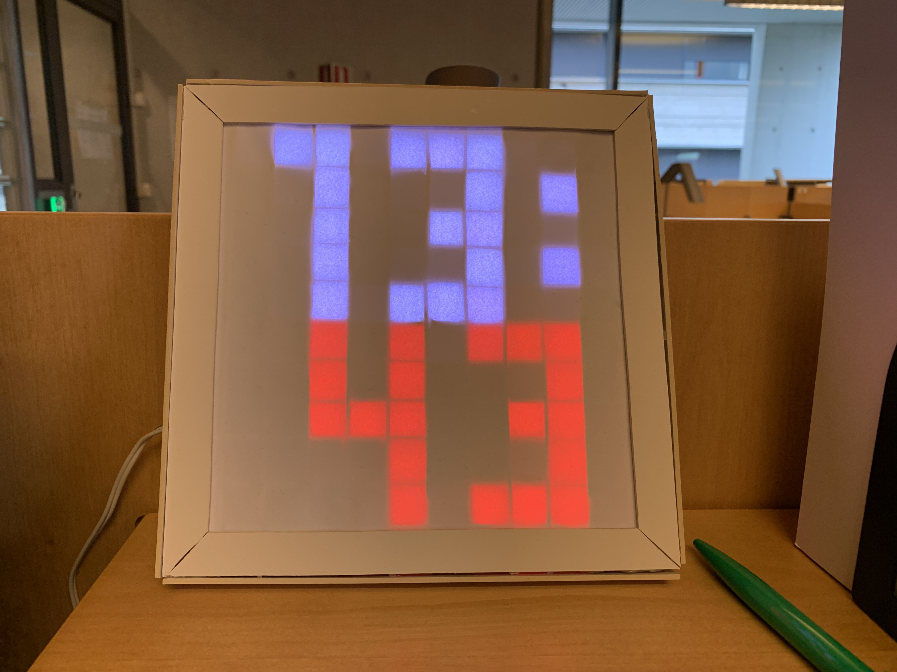

# Arduino LED Matrix RTC Digital Clock

WS2812B based 10x10 px dot matrix display application for a digital clock with RTC module, using a NodeMCU V3 (ESP8266) and DS3231 RTC.

This application requires the Adafruit NeoPixel library for driving the LED strip, however you can use any library you want, if you replace the ```_setNeoPixel()``` function.

The clock currently only supports the 24 hour format, I *might* add 12 hour format later on. It should be a really quick fix, though.


